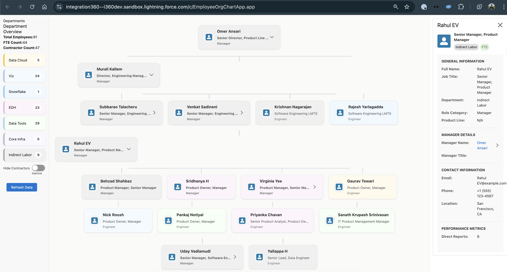
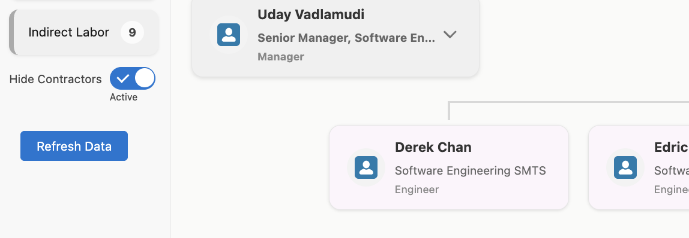
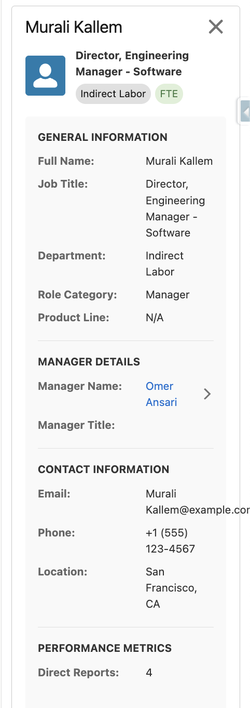
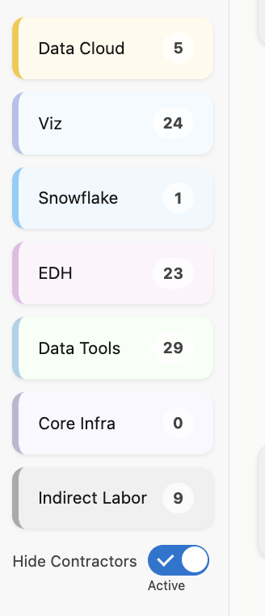

# Employee Organization Chart - Salesforce DX Project

A comprehensive Salesforce application for visualizing and managing the organizational structure of employees within the company.

## Overview

This interactive application provides a dynamic, color-coded visualization of your organization's reporting structure. The chart offers detailed insights into teams, departments, and individual employee profiles with specialized views for different roles and employee types.

## Application Access

Access the Employee Organization Chart application at:
```
https://integration360--i360dev.sandbox.lightning.force.com/c/EmployeeOrgChartApp.app
```



## Key Features

### Interactive Hierarchical Visualization
- Expandable/collapsible nodes for exploring complex organizational structures
- Intuitive navigation with click-through capabilities for exploring reporting chains
- Search and filter functionality to locate specific employees or teams

### Employee Type Differentiation
- Toggle option to show/hide contractors for simplified views



### Department Color Coding
The application uses an intuitive color scheme to instantly identify departments:

| Department     | Visual Appearance | Description                   |
|----------------|-------------------|-------------------------------|
| Data Cloud     | Yellow            | Data Cloud platform teams     |
| Viz            | Blue              | Visualization & BI teams      |
| Snowflake      | Green             | Snowflake database teams      |
| EDH            | Purple/Pink       | Enterprise Data Hub teams     |
| Data Tools     | Light Blue        | Data tooling teams            |
| Core Infra     | Medium Blue       | Core infrastructure teams     |
| Indirect Labor | Grey              | Management & support teams    |

### Role-Based Information Display
When clicking on an employee node, the system displays customized information based on the employee's role:

- **Managers**: Team size statistics, direct reports, department distribution
- **Product Managers**: Product roadmap data, feature ownership, customer statistics
- **Engineers**: Technical specialties, project assignments, productivity metrics


### Department Statistics
The left sidebar provides interactive department filters that display comprehensive metrics:

- Employee count by department
- FTE vs. contractor distribution
- Team composition metrics
- Budget allocation indicators
- Project distribution data

Clicking a department circle generates real-time stats and a filtered view of that department's organizational structure.



### Product Line Segmentation
- View the organization chart segmented by product lines
- Understand how teams are allocated across different products
- Reveal cross-functional product teams that span multiple departments



## Deployment

To deploy this project to a Salesforce org:

```bash
# Deploy all components
./deploy.sh

# Deploy only UI components
./deploy-ui-update.sh

# Clear the cache after deployment
sfdx force:apex:execute -f scripts/refresh-cache.apex -u your-org-alias
```

## Development

This project follows the standard Salesforce DX project structure:

```
force-app/
├── main/
│   └── default/
│       ├── aura/             # Lightning Aura components
│       ├── classes/          # Apex classes
│       ├── lwc/              # Lightning Web Components
│       └── objects/          # Custom objects and fields
```

## Maintenance

For details on maintaining and extending this application, see the [MAINTENANCE_GUIDE.md](MAINTENANCE_GUIDE.md) file.

## Contributing

We welcome contributions to improve the Employee Organization Chart application! Please see [CONTRIBUTING.md](CONTRIBUTING.md) for guidelines on how to submit changes.

## Color Configuration

The color scheme can be updated by modifying the CSS files:
- `force-app/main/default/aura/EmployeeNode/EmployeeNode.css`
- `force-app/main/default/aura/EmployeeOrgChart/EmployeeOrgChart.css`

See [color-mapping.txt](color-mapping.txt) for detailed color assignments.

## License

This project is licensed under the MIT License - see the [LICENSE](LICENSE) file for details.